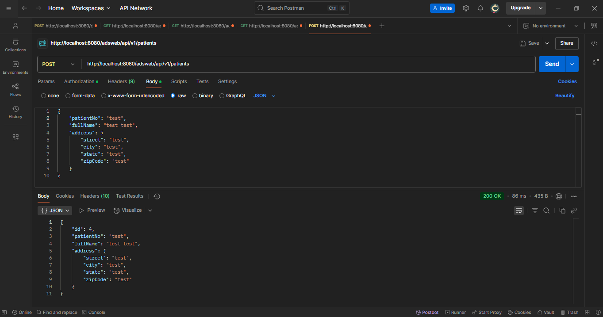

# ADS Dental Surgery Management System (Lab6)

This is a Spring Boot application for managing patients, appointments, surgeries, and users for a dental surgery
management system.

## Features

- Manage patients: Create, update, delete, and search.
- Secure endpoints with JWT authentication.
- Pagination, sorting, and search features.
- PostgreSQL database support (via Docker).
- CI/CD setup with GitHub Actions.

## Technologies Used

- Java 17
- Spring Boot 3
- Spring Data JPA
- Spring Security (JWT)
- PostgreSQL (Docker)
- Maven
- GitHub Actions (CI/CD)

## Running Locally

1. **Clone the repository**:

   ```bash
   git clone https://github.com/bluueface/ApSDLab6.git
   cd lab6
2. **Build the project**:
   ```bash
   mvn clean package
3. **Start PostgreSQL and the app using Docker Compose**:
   ```bash
   docker-compose up --build

## Screenshots





